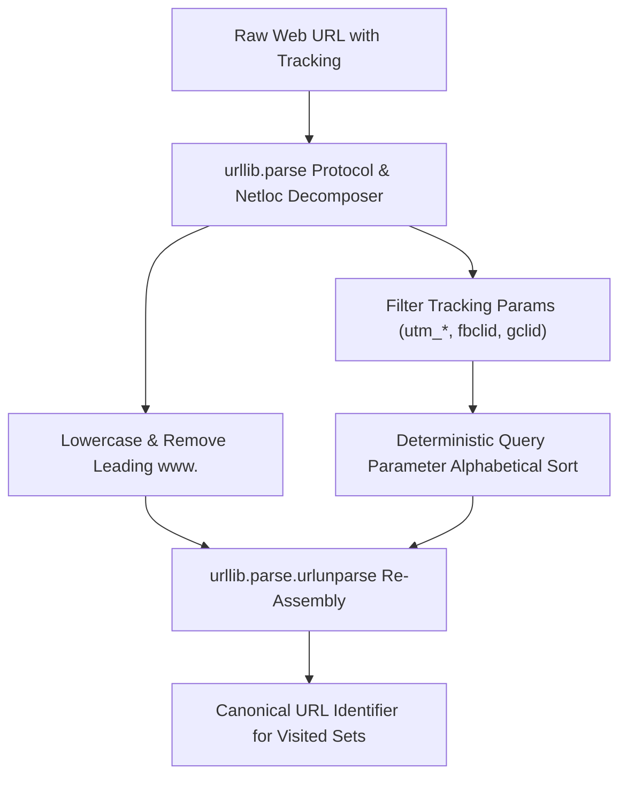

# genpark-url-canonicalization-deduplication-filter-skill

Agent Skill implementing **URL Canonicalization & Tracking Token Stripping** in 100% Python standard library.

## Architectural Flow

```mermaid
flowchart TD
    Raw["Raw Web URL with Tracking"] --> Parse["urllib.parse Protocol & Netloc Decomposer"]
    Parse --> WwwStrip["Lowercase & Remove Leading www."]
    Parse --> QueryStrip["Filter Tracking Params (utm_*, fbclid, gclid)"]
    QueryStrip --> Sort["Deterministic Query Parameter Alphabetical Sort"]
    WwwStrip & Sort --> Unparse["urllib.parse.urlunparse Re-Assembly"]
    Unparse --> Clean["Canonical URL Identifier for Visited Sets"]
```
